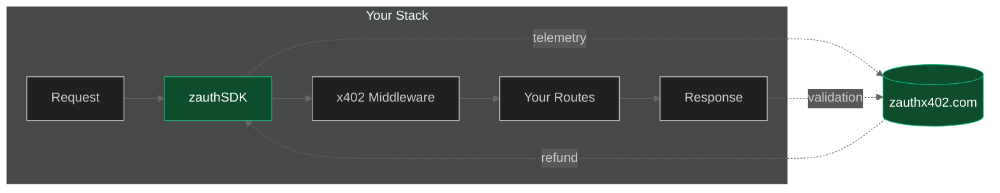
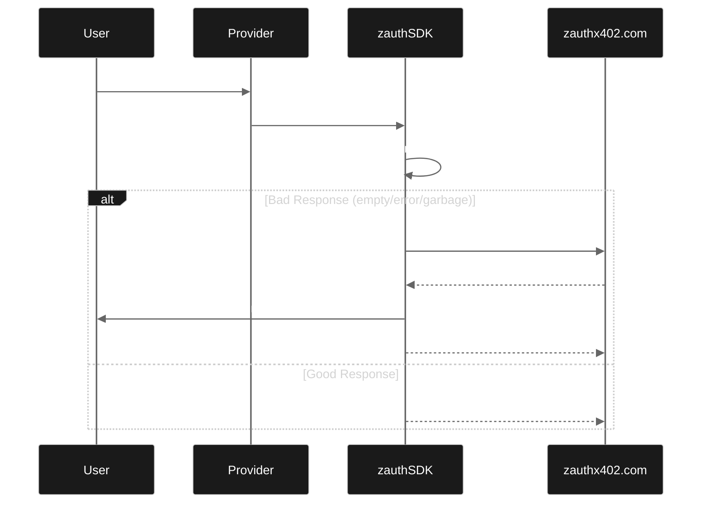

<p align="center">
  
  <br />
  <strong style="font-size: 24px;">@zauthx402/sdk</strong>
</p>

<p align="center">
  
  
  
  
</p>

<p align="center">
  Monitoring, verification, and refund SDK for x402 payment endpoints.
  <br />
  <strong>Works with any x402 implementation</strong> - Coinbase @x402/*, custom implementations, whatever.
</p>

## Installation

```bash
npm install @zauthx402/sdk
```

## Quick Start

```typescript
import express from 'express';
import { zauthProvider } from '@zauthx402/sdk/middleware';

const app = express();

// Add BEFORE your x402 middleware
app.use(zauthProvider('your-api-key'));

// Your existing x402 setup continues unchanged
app.use(x402Middleware(...));
app.get('/api/paid', ...);
```

## Features

- **Non-invasive** - Observes requests/responses without interfering with payments
- **Implementation agnostic** - Works with any x402 implementation (V1/V2)
- **Multi-network** - Supports EVM (Base, Ethereum) and Solana out of the box
- **Full telemetry** - Request params, response bodies, timing, payment details
- **Response validation** - Detect empty, invalid, or error responses
- **Auto-refunds** (optional) - Trigger refunds when responses are bad
- **Per-endpoint config** - Customize validation and refund behavior per route

## How It Works



The SDK:
1. Observes HTTP traffic (headers, bodies, status codes)
2. Parses x402 payment headers (both V1 and V2)
3. Validates responses for "meaningfulness"
4. Reports telemetry to your zauthx402 dashboard
5. Optionally triggers refunds for bad responses

## Configuration

### Full Example

```typescript
import { createZauthMiddleware } from '@zauthx402/sdk/middleware';

app.use(createZauthMiddleware({
  apiKey: 'your-api-key',
  mode: 'provider',

  // Route filtering
  includeRoutes: ['/api/.*'],           // Only monitor these routes
  excludeRoutes: ['/health'],           // Skip these routes

  // Response validation
  validation: {
    requiredFields: ['data'],           // Response must have these fields
    errorFields: ['error', 'errors'],   // These fields indicate errors
    minResponseSize: 10,                // Minimum response size in bytes
    rejectEmptyCollections: true,       // Reject empty arrays/objects
  },

  // Telemetry
  telemetry: {
    includeRequestBody: true,
    includeResponseBody: true,
    maxBodySize: 10000,                 // Truncate bodies larger than this
    redactHeaders: ['authorization'],   // Strip sensitive headers
    redactFields: ['password', 'secret'],
    sampleRate: 1.0,                    // 1.0 = all events, 0.1 = 10%
  },

  // Auto-refunds (see Refunds section below)
  refund: {
    enabled: true,
    privateKey: process.env.ZAUTH_REFUND_PRIVATE_KEY,
    solanaPrivateKey: process.env.ZAUTH_SOLANA_PRIVATE_KEY,
    maxRefundUsd: 1.00,
    dailyCapUsd: 50.00,
    monthlyCapUsd: 500.00,
  },

  debug: true,
}));
```

### Environment Variables

| Variable | Description | Required |
|---|---|---|
| `ZAUTH_API_KEY` | Your zauthx402 API key | Yes |
| `ZAUTH_REFUND_PRIVATE_KEY` | EVM hot wallet private key (hex, `0x...`) | If refunds enabled on EVM |
| `ZAUTH_SOLANA_PRIVATE_KEY` | Solana hot wallet private key (base58) | If refunds enabled on Solana |
| `ZAUTH_API_ENDPOINT` | Custom API endpoint (default: `https://back.zauthx402.com`) | No |

## Auto-Refunds

When enabled, the SDK automatically refunds users who receive bad responses.



### Refund Triggers

The SDK can trigger refunds based on these conditions:

```typescript
refund: {
  enabled: true,
  triggers: {
    serverError: true,       // 5xx status codes
    timeout: true,           // Request timeouts
    emptyResponse: true,     // Empty or meaningless response body
    schemaValidation: false, // Response doesn't match expected schema
    minMeaningfulness: 0.3,  // AI-scored meaningfulness threshold (0-1)
  },
}
```

### EVM-Only Setup (Base)

If your endpoint only accepts EVM payments:

```bash
npm install viem
```

```typescript
app.use(zauthProvider('your-api-key', {
  refund: {
    enabled: true,
    privateKey: process.env.ZAUTH_REFUND_PRIVATE_KEY,
    network: 'base',
    maxRefundUsd: 1.00,
  },
}));
```

```bash
# .env
ZAUTH_REFUND_PRIVATE_KEY=0xYourEvmPrivateKeyHex
```

### Solana-Only Setup

If your endpoint only accepts Solana payments:

```typescript
app.use(zauthProvider('your-api-key', {
  refund: {
    enabled: true,
    solanaPrivateKey: process.env.ZAUTH_SOLANA_PRIVATE_KEY,
    network: 'solana',
    maxRefundUsd: 1.00,
  },
}));
```

```bash
# .env
ZAUTH_SOLANA_PRIVATE_KEY=YourSolanaPrivateKeyBase58
```

### Dual-Network Setup (EVM + Solana)

If your endpoint accepts both EVM and Solana payments (x402 V2), provide both keys. The SDK automatically routes refunds to the correct network based on how the user originally paid.

```bash
npm install viem
```

```typescript
app.use(zauthProvider('your-api-key', {
  refund: {
    enabled: true,
    privateKey: process.env.ZAUTH_REFUND_PRIVATE_KEY,
    solanaPrivateKey: process.env.ZAUTH_SOLANA_PRIVATE_KEY,
    maxRefundUsd: 1.00,
    dailyCapUsd: 50.00,
  },
}));
```

```bash
# .env
ZAUTH_REFUND_PRIVATE_KEY=0xYourEvmPrivateKeyHex
ZAUTH_SOLANA_PRIVATE_KEY=YourSolanaPrivateKeyBase58
```

If a user pays via Base and gets a bad response, the refund goes out on Base using your EVM key. If they pay via Solana, it goes out on Solana using your Solana key. If you only configure one key, refunds on the other network will fail gracefully with a log message.

### Safety Limits

```typescript
refund: {
  enabled: true,
  maxRefundUsd: 1.00,      // Max per single refund
  dailyCapUsd: 50.00,      // Max total refunds per day
  monthlyCapUsd: 500.00,   // Max total refunds per month
},
```

### Refund Callbacks

```typescript
refund: {
  enabled: true,
  onRefund: (refund) => {
    console.log(`Refunded $${refund.amountUsd} to ${refund.recipient} on ${refund.network}`);
    console.log(`Tx: ${refund.txHash}`);
  },
  onRefundError: (error) => {
    console.error(`Refund failed for ${error.url}: ${error.error}`);
  },
},
```

## Per-Endpoint Configuration

You can customize validation and refund behavior for individual endpoints using `expectedResponse` and per-endpoint overrides.

### `expectedResponse`

The `expectedResponse` field is a plain-text description of what a valid response looks like. It's used for AI-powered validation — the SDK scores how "meaningful" a response is relative to what was expected.

```typescript
app.use(createZauthMiddleware({
  apiKey: 'your-api-key',
  mode: 'provider',

  refund: {
    enabled: true,
    privateKey: process.env.ZAUTH_REFUND_PRIVATE_KEY,
    solanaPrivateKey: process.env.ZAUTH_SOLANA_PRIVATE_KEY,
    maxRefundUsd: 1.00,

    endpoints: {
      '/api/weather': {
        expectedResponse: 'JSON object with temperature, humidity, wind speed, and forecast for the requested location',
        maxRefundUsd: 0.50,
        triggers: {
          emptyResponse: true,
          minMeaningfulness: 0.5,
        },
      },
      '/api/translate': {
        expectedResponse: 'JSON with translated_text field containing the translation in the target language',
        maxRefundUsd: 0.10,
      },
      '/api/expensive-report': {
        maxRefundUsd: 5.00,       // Higher cap for expensive endpoint
        enabled: true,
      },
      '/api/beta-endpoint': {
        enabled: false,            // Disable refunds for this endpoint
      },
    },
  },
}));
```

### Custom Refund Logic

For full control, use `shouldRefund` to decide per-request:

```typescript
endpoints: {
  '/api/data': {
    shouldRefund: (response, statusCode, validationResult) => {
      // Only refund if the response is truly empty
      if (statusCode >= 500) return true;
      if (!response || Object.keys(response).length === 0) return true;
      return false;
    },
  },
},
```

## Examples

See the `/examples` directory:

- `provider-express/` - Express server with monitoring and refunds

## Local Development

A test server is available for E2E testing (git-ignored):

```bash
cd test-server
npm install
npm start
```

## API Reference

### Exports

```typescript
// Main
export { ZauthClient, createClient } from '@zauthx402/sdk';

// Middleware
export { createZauthMiddleware, zauthProvider } from '@zauthx402/sdk/middleware';

// Validation
export { validateResponse, createSchemaValidator } from '@zauthx402/sdk';

// Refunds
export { RefundHandler, createRefundHandler } from '@zauthx402/sdk';

// Types
export * from '@zauthx402/sdk'; // All types
```

### Supported Networks

| Network | Value | Key Config |
|---|---|---|
| Base (mainnet) | `'base'` | `privateKey` |
| Base Sepolia (testnet) | `'base-sepolia'` | `privateKey` |
| Solana (mainnet) | `'solana'` | `solanaPrivateKey` |
| Solana Devnet | `'solana-devnet'` | `solanaPrivateKey` |
| Solana Testnet | `'solana-testnet'` | `solanaPrivateKey` |

## Get Your API Key

Sign up at [zauthx402.com](https://zauthx402.com) to get your API key and access the monitoring dashboard.

## License

MIT
