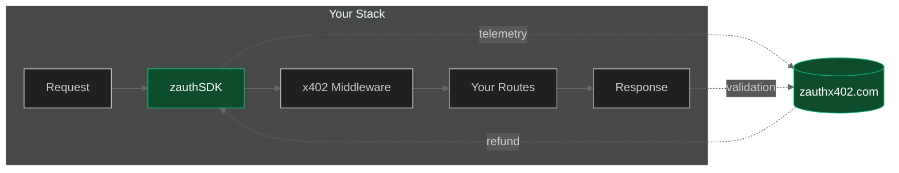
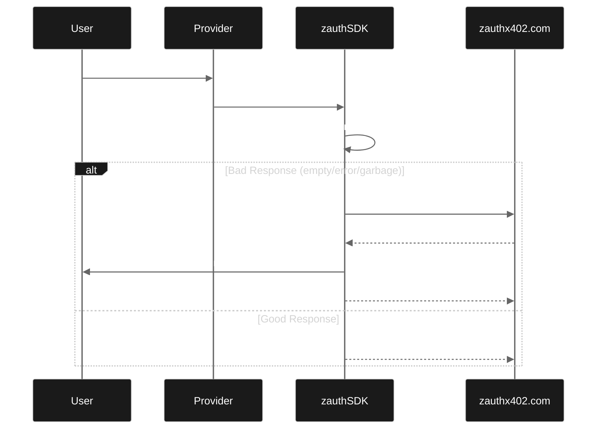

<p align="center">
  
  <br />
  <strong style="font-size: 24px;">@zauthx402/sdk</strong>
</p>

<p align="center">
  
  
  
  
</p>

<p align="center">
  Monitoring, verification, and refund SDK for x402 payment endpoints.
  <br />
  <strong>Works with any x402 implementation</strong> - Coinbase @x402/*, custom implementations, whatever.
</p>

## Installation

```bash
npm install @zauthx402/sdk
```

## Quick Start

```typescript
import express from 'express';
import { zauthProvider } from '@zauthx402/sdk/middleware';

const app = express();

// Add BEFORE your x402 middleware
app.use(zauthProvider('your-api-key'));

// Your existing x402 setup continues unchanged
app.use(x402Middleware(...));
app.get('/api/paid', ...);
```

## Features

- **Non-invasive** - Observes requests/responses without interfering with payments
- **Implementation agnostic** - Works with any x402 implementation (V1/V2)
- **Full telemetry** - Request params, response bodies, timing, payment details
- **Response validation** - Detect empty, invalid, or error responses
- **Auto-refunds** (optional) - Trigger refunds when responses are bad

## How It Works



The SDK:
1. Observes HTTP traffic (headers, bodies, status codes)
2. Parses x402 payment headers (both V1 and V2)
3. Validates responses for "meaningfulness"
4. Reports telemetry to your zauthx402 dashboard
5. Optionally triggers refunds for bad responses

## Configuration

```typescript
import { createZauthMiddleware } from '@zauthx402/sdk/middleware';

app.use(createZauthMiddleware({
  apiKey: 'your-api-key',
  mode: 'provider',

  // Validation rules
  validation: {
    requiredFields: ['data'],           // Must have these fields
    errorFields: ['error', 'errors'],   // These indicate errors
    minResponseSize: 10,                // Minimum response size
    rejectEmptyCollections: true,       // Reject empty arrays/objects
  },

  // Route filtering
  includeRoutes: ['/api/.*'],           // Only monitor these
  excludeRoutes: ['/health'],           // Skip these

  // Telemetry options
  telemetry: {
    includeRequestBody: true,
    includeResponseBody: true,
    maxBodySize: 10000,
    redactHeaders: ['authorization'],
    redactFields: ['password', 'secret'],
    sampleRate: 1.0,                    // 1.0 = all, 0.1 = 10%
  },

  // Auto-refunds (optional)
  refund: {
    enabled: true,
    privateKey: process.env.ZAUTH_REFUND_PRIVATE_KEY,
    network: 'base',
    maxRefundUsdc: '1.00',
  },

  debug: true,
}));
```

## Auto-Refunds

When enabled, the SDK can automatically refund users who receive bad responses:



**Requirements:**
- `viem` package installed
- Hot wallet private key configured
- Network matches endpoint network

```bash
npm install viem
export ZAUTH_REFUND_PRIVATE_KEY=your-hot-wallet-key
```

## Examples

See the `/examples` directory:

- `provider-express/` - Express server with monitoring

## Local Development

A test server is available for E2E testing (git-ignored):

```bash
cd test-server
npm install
npm start
```

## API Reference

### Exports

```typescript
// Main
export { ZauthClient, createClient } from '@zauthx402/sdk';

// Middleware
export { createZauthMiddleware, zauthProvider } from '@zauthx402/sdk/middleware';

// Validation
export { validateResponse, createSchemaValidator } from '@zauthx402/sdk';

// Refunds
export { RefundHandler, createRefundHandler } from '@zauthx402/sdk';

// Types
export * from '@zauthx402/sdk'; // All types
```

## Get Your API Key

Sign up at [zauthx402.com](https://zauthx402.com) to get your API key and access the monitoring dashboard.

## License

MIT
